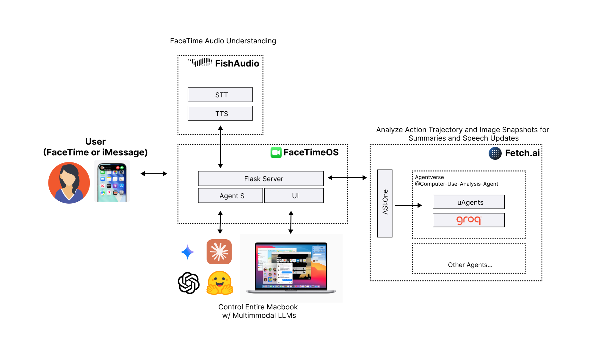

# FaceTimeOS: Mac-use AI Voice Agents

Control your entire Mac with AI voice Agents, via:

1. **FaceTime**: Text your Mac asking to start a FaceTime, it start a session and share screen. Then, talk naturally to instruct any computer-related task.
2. **iMessage**: Text any other prompt, it will fulfill your task

🏆 **1st Place Grand Prize** at Cal Hacks 12.0 (world's largest collegiate hackathon) - [Devpost](https://devpost.com/software/facetime-macos-ai-agent)
- The team: Dylan Lu, Calvin Lu, Davyn Paringkoan

## FaceTime Demo

<a href="https://www.youtube.com/watch?v=zN96RdE0OSg" target="_blank">
  <picture>
    
  </picture>
</a>

> Click the image to watch the full demo on YouTube.

## iMessage Demo

https://github.com/user-attachments/assets/77a8fe7f-ca2f-4002-9a24-dcf0cfffc0de

## Overview

Our project is organized into three folders

1. `Agent-S` — Our fork of the current SoTA computer-use agent framework. [Original Repo](https://github.com/simular-ai/Agent-S)
2. `backend` - Flask server to handle iMessage/FaceTime and generate voice transcriptions and replies
3. `frontend` — UI to prompt and view current actions of Agent S



## Quick Start

All you need is a single LLM key. Export `OPENAI_API_KEY` (or swap in the key for your preferred provider) and you’re ready.

**1. Install dependencies**

```bash
git clone https://github.com/ThePickleGawd/FaceTimeOS.git
cd FaceTimeOS

# Setup Agent-S (see original repo for more details/debugging)
cd Agent-S
uv sync

cd ..

# Setup backend
cd backend
uv sync

cd ..

# Setup UI
cd frontend
SHARP_IGNORE_GLOBAL_LIBVIPS=1 npm install --ignore-scripts
npm rebuild sharp
```

For more details on Agent S: https://github.com/simular-ai/Agent-S

**2. Provide your API key**

```bash
# Put this in ~/.zshrc or export it manually
# Grok is recommended and is currently working with no issues
export GROK_API_KEY="xai-your-grok-key"

# There are some issues with OpenAI (it worked at one point though!)
export OPEN_API_KEY="sk-your-openai-key"
```

See the `run_*.sh` files in Agent-S for an idea of what providers we support and how to add your own.

https://fish.audio/app/api-keys/

```bash
# Optional: To enable TTS and STT
export FISH_API_KEY="key"
```

**3. Give Agent Permission to Control Keyboard/Mouse**

When you launch for the first time (see final step), you will be prompted to give permissions to `Terminal` or `VS Code`, etc. This is required for the Agent to control your computer.

|                     Assesibility                      |                   Automation                    |                    Disk Access                    |
| :---------------------------------------------------: | :---------------------------------------------: | :-----------------------------------------------: |
|  |  |  |

**4. Route FaceTime audio input/output (optional)**

To route audio directly from FaceTime to our AI Agent, install a lightweight MacOS app. This is optional if you want to use iMessage only.


- Install BlackHole App (Install _both_ 2 and 16 channel version. No config is needed): https://github.com/ExistentialAudio/BlackHole
- Restart computer
- In FaceTime menu, `Video->Microphone` set to BlackHole 2ch. And `Video->Output` set to BlackHole 16ch

**5. Launch FaceTimeOS**

In the base directory:

```bash
# Run everything (UI, backend, Agent S). Change as needed for correct LLM provider
./run.sh
```

Note: The UI Grounding endpoint is no longer live. However, this is not needed unless you want the absolute best clicking accuracy. To set this up yourself, visit: https://github.com/bytedance/UI-TARS/blob/main/README_deploy.md

## Why FaceTimeOS?

#### 1. Seamless Remote Control

Why download clunky remote desktop apps when you can simply **FaceTime your Mac**?  
FaceTimeOS lets you call or message your computer directly through **native Apple interfaces** — no extra setup, no third-party tools, just the simplicity of FaceTime and iMessage.

#### 2. Human-Level Intelligence

Powered by our extended **Agent S3** framework, FaceTimeOS achieves **state-of-the-art (OSWorld-verified)** performance on common computer-use tasks — surpassing existing systems like OpenAI or Anthropic’s Computer-Use Agents.  
We bring **human-level computer interaction** to everyone, accessible from anywhere in the world.
